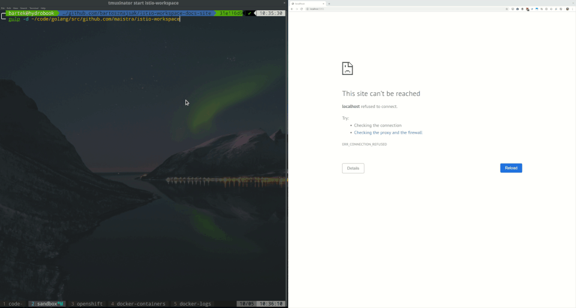

:url-docs: https://github.com/maistra/istio-workspace/tree/docs

== Before you start

- Make sure you have `node` and `npm` installed
- `npm run init` 

== Generate the docs

- `npm run build`
- `gulp open`

This documentation is generated from {url-docs}

== Preview Mode

This project comes with a preview mode too, using which you can instantly see the changes of the docs you are working on.

To use it, run the following:

. Install dependencies.
+
[source,bash]
----
npm run init
----

. Install the LiveReload https://chrome.google.com/webstore/detail/livereload/jnihajbhpnppcggbcgedagnkighmdlei?hl=en[chrome extension].

. Start the preview mode.
The web server's host URL is printed to the console after the `watch` task completes.
+
[source,bash]
----
gulp -d DOCS_DIRECTORY
----
+
Where `DOCS_DIRECTORY` points to your local clone of {url-docs}.

TIP: If your docs and source repositories directories live next to each other (e.g. in the same parent folder) can simply run `npm rum preview` instead.

. The console output will print status information every time a change is detected.
+
[source,bash]
----
[20:09:56] Starting 'connect'...
[20:09:56] Starting server...
[20:09:56] Finished 'connect' after 4.96 ms
[20:09:56] Starting 'watch'...
[20:09:57] Finished 'watch' after 952 ms
[20:09:57] Starting 'build'...
[20:09:57] Istio Workspace Antora Doc Server started http://localhost:5353                         
[20:09:57] LiveReload started on port 35729
[20:09:57] Running server
----

. Make changes to your AsciiDoc files locally.
+
The browser tab should automatically reload after a short while.
+

